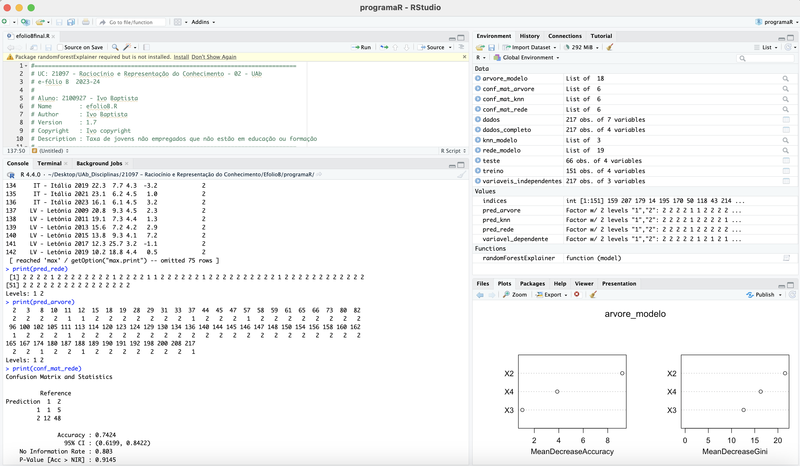

<h1 align="center">
    
</h1>

# EfolioB-RRC

# TESTE com ANTLR e Python

📌 EfolioB de RRC - árvore de decisão,  K vizinhos mais próximos e Redes neuronais
------------------
O e-fólio B consiste essencialmente na realização da atividade de aprendizagem: usando bibliotecas em R, usando dados e um indicador objetivo à sua escolha.

Sugere-se que considere como observações dados de países e anos, e procure aprender o que influencia um dos indicadores de um dos objetivos de desenvolvimento sustentável (dados no pordata).

1) Refira no fórum do espaço central o indicador que está a procurar aprender, de modo a evitar colisões de trabalhos entre estudantes. Utilize o tópico "[E-fólio B] Escolha de indicador"

2) Selecione entre 3 e 6 variáveis independentes que representem observações que possam influenciar o indicador escolhido.

2) Aplique os 3 métodos de aprendizagem (árvores de decisão, k vizinhos mais próximos e redes neuronais), calculando a performance de cada método, e indicando as variáveis observáveis mais úteis.

3) Apresente um relatório (máx. 2 páginas, excluindo folha de rosto e anexos) com a seguinte estrutura:

indicador escolhido, descrição das variáveis independentes, e porque pensa que influenciam o indicador, nº de exemplos/observações utilizados para treino e para teste
descrição da implementação de cada método, com foco nas decisões tomadas (ex. tratamento, categorização ou normalização dos dados, necessários para aplicar cada algoritmo)
conclusões sobre os resultados obtidos, a performance de cada método e variáveis mais úteis
anexo onde deverá colocar o código usado e tabelas de resultados

Critérios de avaliação:

Implementação de árvore de decisão: 1 valor
Implementação de K vizinhos mais próximos: 1 valor
Implementação de Redes neuronais: 1 valor
Relatório (organização, clareza, fundamentação): 1 valor

## Pré-requisitos

- R: the R Project for Statistical Computing - https://www.r-project.org
- https://www.pordata.pt/ods/goal/trabalho+digno+e+crescimento+economico-8
- Excell

## Passo a Passo

### 1. Importar os ficheros em Excell

Importamos todos os ficheiros do indicador e as variaveis.

### 2. Converter os Ficheiros para formato CSV

Converter os dados para CSV com Excell.

### 3. Preparar o Ambiente R

Certifique-se de que Rstudio está instalado.

### 4. Escrever e executar o Script de Teste em R

Executamos o comando para testar a interpretação do programa

<pre> source("efolioBfinal.R", echo=TRUE) </pre>

Resultado: 
> 
> #============================================================================
> # UC: 21097 - Raciocínio e Representação do Conhecimento - 02 - UAb
 .... [TRUNCATED] 

> # Instalar pacotes necessários se não estiverem instalados
> if (!require('randomForest')) install.packages('randomForest', dependencies=TRUE)

> if (!require('caret')) install.packages('caret', dependencies=TRUE)

> if (!require('nnet')) install.packages('nnet', dependencies=TRUE)

> if (!require('ggplot2')) install.packages('ggplot2', dependencies=TRUE)

> # Carregar bibliotecas
> library(randomForest)

> library(caret)

> library(nnet)

> library(ggplot2)

> # Carregar os dados
> dados <- read.csv("dados_jovens.csv", header = TRUE, sep = ";", stringsAsFactors = FALSE, fill = TRUE)

> # Visualizar os dados para verificar se foram carregados corretamente
> head(dados)
         Paises Anos   X1   X2  X3   X4
1 DE - Alemanha 2009 12,9 11,1 3,4 -5,7
2 DE - Alemanha 2011   11 11,6 3,4  3,9
3 DE - Alemanha 2013  9,9  9,8 3,2  0,4
4 DE - Alemanha 2015  9,6 10,1 3,1  1,5
5 DE - Alemanha 2017  9,6 10,1   3  2,7
6 DE - Alemanha 2019  8,6 10,3 2,9  1,1

> # Verificar a estrutura dos dados
> str(dados)
'data.frame':	651 obs. of  6 variables:
 $ Paises: chr  "DE - Alemanha" "DE - Alemanha" "DE - Alemanha" "DE - Alemanha" ...
 $ Anos  : int  2009 2011 2013 2015 2017 2019 2021 2023 2009 2011 ...
 $ X1    : chr  "12,9" "11" "9,9" "9,6" ...
 $ X2    : chr  "11,1" "11,6" "9,8" "10,1" ...
 $ X3    : chr  "3,4" "3,4" "3,2" "3,1" ...
 $ X4    : chr  "-5,7" "3,9" "0,4" "1,5" ...

> # Converter variáveis de caracteres para numéricos (necessário para processamento correto)
> dados$X1 <- as.numeric(sub(",", ".", dados$X1))

> dados$X2 <- as.numeric(sub(",", ".", dados$X2))

> dados$X3 <- as.numeric(sub(",", ".", dados$X3))

> dados$X4 <- as.numeric(sub(",", ".", dados$X4))

> # Remover linhas com valores NA
> dados <- na.omit(dados)

> # Adicionar coluna Meta_Atingida: 1 para sim e 2 para não
> dados$Meta_Atingida <- ifelse(dados$X1 <= 9, 1, 2)

> # Visualizar os dados
> head(dados)
         Paises Anos   X1   X2  X3   X4 Meta_Atingida
1 DE - Alemanha 2009 12.9 11.1 3.4 -5.7             2
2 DE - Alemanha 2011 11.0 11.6 3.4  3.9             2
3 DE - Alemanha 2013  9.9  9.8 3.2  0.4             2
4 DE - Alemanha 2015  9.6 10.1 3.1  1.5             2
5 DE - Alemanha 2017  9.6 10.1 3.0  2.7             2
6 DE - Alemanha 2019  8.6 10.3 2.9  1.1             1

> # Separar variáveis independentes e dependente
> variaveis_independentes <- dados[, c("X2", "X3", "X4")]

> variavel_dependente <- dados$Meta_Atingida

> # Garantir que a variável dependente é um fator
> variavel_dependente <- as.factor(variavel_dependente)

> # Combinar variáveis independentes e dependente novamente para formar os conjuntos de treino e teste
> dados_completo <- cbind(variaveis_independent .... [TRUNCATED] 

> # Divisão em conjuntos de treino e teste
> set.seed(123)

> indices <- sample(1:nrow(dados_completo), size = 0.7 * nrow(dados_completo))

> treino <- dados_completo[indices, ]

> teste <- dados_completo[-indices, ]

> ### 4.1. Tarefa 4.1: Árvores de Decisão
> 
> # Treinar o modelo de árvore de decisão
> arvore_modelo <- randomForest(x = treino[, 1:3], y = treino[, .... [TRUNCATED] 

> print(arvore_modelo)

Call:
 randomForest(x = treino[, 1:3], y = treino[, 4], ntree = 100,      importance = TRUE) 
               Type of random forest: classification
                     Number of trees: 100
No. of variables tried at each split: 1

        OOB estimate of  error rate: 21.85%
Confusion matrix:
   1   2 class.error
1 10  24  0.70588235
2  9 108  0.07692308

> # Confirmar que foi uma classificação e não uma regressão
> print(arvore_modelo$type)
[1] "classification"

> # Fazer previsões no conjunto de teste
> pred_arvore <- predict(arvore_modelo, teste[, 1:3])

> # Avaliar a performance do modelo
> cat("Árvore de Decisão - Matriz de Confusão:\n")
Árvore de Decisão - Matriz de Confusão:

> conf_mat_arvore <- confusionMatrix(pred_arvore, teste[, 4])

> print(conf_mat_arvore)
Confusion Matrix and Statistics

          Reference
Prediction  1  2
         1  3  6
         2 10 47
                                          
               Accuracy : 0.7576          
                 95% CI : (0.6364, 0.8546)
    No Information Rate : 0.803           
    P-Value [Acc > NIR] : 0.8599          
                                          
                  Kappa : 0.133           
                                          
 Mcnemar's Test P-Value : 0.4533          
                                          
            Sensitivity : 0.23077         
            Specificity : 0.88679         
         Pos Pred Value : 0.33333         
         Neg Pred Value : 0.82456         
             Prevalence : 0.19697         
         Detection Rate : 0.04545         
   Detection Prevalence : 0.13636         
      Balanced Accuracy : 0.55878         
                                          
       'Positive' Class : 1               
                                          

> # Importância das Variáveis na Árvore de Decisão
> cat("Importância das Variáveis:\n")
Importância das Variáveis:

> print(importance(arvore_modelo))
          1          2 MeanDecreaseAccuracy MeanDecreaseGini
X2 6.828680  7.9633314             9.190741         21.54032
X3 2.895261 -0.7445043             1.022850         12.60203
X4 2.272132  3.0900849             3.872191         16.29301

> varImpPlot(arvore_modelo)

> ### 4.2. Tarefa 4.2: K Vizinhos Mais Próximos
> 
> # Treinar o modelo de KNN
> knn_modelo <- knn3(x = treino[, 1:3], y = treino[, 4], k = 3)

> print(knn_modelo)
3-nearest neighbor model
Training set outcome distribution:

  1   2 
 34 117 

> # Fazer previsões no conjunto de teste
> pred_knn <- predict(knn_modelo, teste[, 1:3])

> # Ajustar níveis para a matriz de confusão
> pred_knn <- factor(max.col(pred_knn), levels = levels(teste$Meta_Atingida))

> # Avaliar a performance do modelo
> cat("K Vizinhos Mais Próximos - Matriz de Confusão:\n")
K Vizinhos Mais Próximos - Matriz de Confusão:

> conf_mat_knn <- confusionMatrix(pred_knn, teste$Meta_Atingida)

> print(conf_mat_knn)
Confusion Matrix and Statistics

          Reference
Prediction  1  2
         1  3 11
         2 10 42
                                          
               Accuracy : 0.6818          
                 95% CI : (0.5556, 0.7911)
    No Information Rate : 0.803           
    P-Value [Acc > NIR] : 0.9936          
                                          
                  Kappa : 0.0226          
                                          
 Mcnemar's Test P-Value : 1.0000          
                                          
            Sensitivity : 0.23077         
            Specificity : 0.79245         
         Pos Pred Value : 0.21429         
         Neg Pred Value : 0.80769         
             Prevalence : 0.19697         
         Detection Rate : 0.04545         
   Detection Prevalence : 0.21212         
      Balanced Accuracy : 0.51161         
                                          
       'Positive' Class : 1               
                                          

> ### 4.3. Tarefa 4.3: Redes Neuronais
> 
> # Treinar o modelo de rede neural
> rede_modelo <- nnet(Meta_Atingida ~ ., data = treino, size = 5, linout .... [TRUNCATED] 

> print(rede_modelo)
a 3-5-1 network with 26 weights
inputs: X2 X3 X4 
output(s): Meta_Atingida 
options were - entropy fitting 

> # Mostrar os pesos da rede
> cat("Pesos da Rede Neuronal:\n")
Pesos da Rede Neuronal:

> print(rede_modelo$wts)
 [1] -9454.571838  1028.218793   400.613691  -411.659311 -9008.186211 -7025.462864  7202.303440  3142.600517   111.510864   -12.820578
[11]  -366.655103    92.255667   -63.675527    57.783893    35.198519   -44.141759  8426.473816  -369.620252 -1012.305431 -1044.660635
[21]   -62.009386     2.750503  2700.415784  -156.953272    62.405023    -1.669902

> # Fazer previsões no conjunto de teste
> pred_rede <- predict(rede_modelo, teste[, 1:3], type = "class")

> # Ajustar níveis para a matriz de confusão
> pred_rede <- factor(pred_rede, levels = levels(teste$Meta_Atingida))

> # Avaliar a performance do modelo
> cat("Redes Neurais - Matriz de Confusão:\n")
Redes Neurais - Matriz de Confusão:

> conf_mat_rede <- confusionMatrix(pred_rede, teste$Meta_Atingida)

> print(conf_mat_rede)
Confusion Matrix and Statistics

          Reference
Prediction  1  2
         1  1  5
         2 12 48
                                          
               Accuracy : 0.7424          
                 95% CI : (0.6199, 0.8422)
    No Information Rate : 0.803           
    P-Value [Acc > NIR] : 0.9145          
                                          
                  Kappa : -0.0219         
                                          
 Mcnemar's Test P-Value : 0.1456          
                                          
            Sensitivity : 0.07692         
            Specificity : 0.90566         
         Pos Pred Value : 0.16667         
         Neg Pred Value : 0.80000         
             Prevalence : 0.19697         
         Detection Rate : 0.01515         
   Detection Prevalence : 0.09091         
      Balanced Accuracy : 0.49129         
                                          
       'Positive' Class : 1               
                                          

> ### Resultados e Reflexões
> 
> # Árvore de Decisão - Resultados
> cat("\nResultados - Árvore de Decisão:\n")

Resultados - Árvore de Decisão:

> cat("Erro Médio Estimado: ", mean(arvore_modelo$err.rate[,1]), "\n")
Erro Médio Estimado:  0.2340981 

> cat("Importância das Variáveis:\n")
Importância das Variáveis:

> print(importance(arvore_modelo))
          1          2 MeanDecreaseAccuracy MeanDecreaseGini
X2 6.828680  7.9633314             9.190741         21.54032
X3 2.895261 -0.7445043             1.022850         12.60203
X4 2.272132  3.0900849             3.872191         16.29301

> print(conf_mat_arvore)
Confusion Matrix and Statistics

          Reference
Prediction  1  2
         1  3  6
         2 10 47
                                          
               Accuracy : 0.7576          
                 95% CI : (0.6364, 0.8546)
    No Information Rate : 0.803           
    P-Value [Acc > NIR] : 0.8599          
                                          
                  Kappa : 0.133           
                                          
 Mcnemar's Test P-Value : 0.4533          
                                          
            Sensitivity : 0.23077         
            Specificity : 0.88679         
         Pos Pred Value : 0.33333         
         Neg Pred Value : 0.82456         
             Prevalence : 0.19697         
         Detection Rate : 0.04545         
   Detection Prevalence : 0.13636         
      Balanced Accuracy : 0.55878         
                                          
       'Positive' Class : 1               
                                          

> # K Vizinhos Mais Próximos - Resultados
> cat("\nResultados - K Vizinhos Mais Próximos:\n")

Resultados - K Vizinhos Mais Próximos:

> print(conf_mat_knn)
Confusion Matrix and Statistics

          Reference
Prediction  1  2
         1  3 11
         2 10 42
                                          
               Accuracy : 0.6818          
                 95% CI : (0.5556, 0.7911)
    No Information Rate : 0.803           
    P-Value [Acc > NIR] : 0.9936          
                                          
                  Kappa : 0.0226          
                                          
 Mcnemar's Test P-Value : 1.0000          
                                          
            Sensitivity : 0.23077         
            Specificity : 0.79245         
         Pos Pred Value : 0.21429         
         Neg Pred Value : 0.80769         
             Prevalence : 0.19697         
         Detection Rate : 0.04545         
   Detection Prevalence : 0.21212         
      Balanced Accuracy : 0.51161         
                                          
       'Positive' Class : 1               
                                          

> # Redes Neurais - Resultados
> cat("\nResultados - Redes Neurais:\n")

Resultados - Redes Neurais:

> print(conf_mat_rede)
Confusion Matrix and Statistics

          Reference
Prediction  1  2
         1  1  5
         2 12 48
                                          
               Accuracy : 0.7424          
                 95% CI : (0.6199, 0.8422)
    No Information Rate : 0.803           
    P-Value [Acc > NIR] : 0.9145          
                                          
                  Kappa : -0.0219         
                                          
 Mcnemar's Test P-Value : 0.1456          
                                          
            Sensitivity : 0.07692         
            Specificity : 0.90566         
         Pos Pred Value : 0.16667         
         Neg Pred Value : 0.80000         
             Prevalence : 0.19697         
         Detection Rate : 0.01515         
   Detection Prevalence : 0.09091         
      Balanced Accuracy : 0.49129         
                                          
       'Positive' Class : 1               
                                          

> ### Conclusão
> cat("\nConclusão:\n")

Conclusão:

> cat("Após aplicar os três métodos de aprendizagem supervisionada, foram observados os seguintes resultados:\n")
Após aplicar os três métodos de aprendizagem supervisionada, foram observados os seguintes resultados:

> cat("Árvore de Decisão apresentou um erro médio estimado de ", mean(arvore_modelo$err.rate[,1]), " e mostrou que a variável mais importante foi X2.\ ..." ... [TRUNCATED] 
Árvore de Decisão apresentou um erro médio estimado de  0.2340981  e mostrou que a variável mais importante foi X2.

> cat("O método K Vizinhos Mais Próximos teve uma precisão de ", conf_mat_knn$overall['Accuracy'], ".\n")
O método K Vizinhos Mais Próximos teve uma precisão de  0.6818182 .

> cat("O método de Redes Neurais teve uma precisão de ", conf_mat_rede$overall['Accuracy'], ".\n")
O método de Redes Neurais teve uma precisão de  0.7424242 .

> cat("Analisando os resultados, podemos concluir que o modelo de Árvores de Decisão apresentou melhor performance em termos de erro médio, enquanto o ..." ... [TRUNCATED] 
Analisando os resultados, podemos concluir que o modelo de Árvores de Decisão apresentou melhor performance em termos de erro médio, enquanto o modelo de Redes Neurais teve uma precisão ligeiramente inferior. O K Vizinhos Mais Próximos teve a menor precisão entre os três métodos.
> 
O projeto foi feito em Rstudio 

The project was done with Rstudio

🔧 Tecnologias utilizadas:
------------------

- Rstudio
- Excell 

💬 Fale comigo
------------------
[*Entre em contato comigo*](https://www.linkedin.com/in/ivo-baptista-3712144/)
